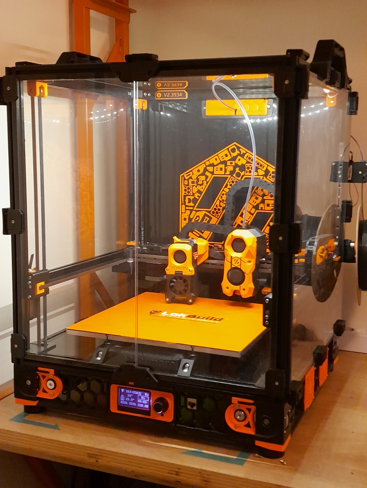

# V2.3934 #
Mod and config of Voron 2.4

For now the printer is almost stock except:
- Klicky probe
- Nozzle brush
- 24v warm/cold leds for caselight
- rama pinned front idlers

### 25/09/2022 : first Upgrade ###

- XY pinned mod
- GE5C Z-joint
- Stealthburner
- X Y endstop relocation
- LGX lite with 2 part PCB
- Filament runout sensor by Tircown



DO NOT take this configuration for your printer without checking the configuration. As new features are frequently experimented, some macros can be difficult to extract and adapt to another printer. 

## Klipper config ##

Entire configuration folder of My Voron 2.4 printer
This was inspired by the great Voron User Community

Many scripts are unmodified from shared configuration on github, See list of authors below 
[Frix_x/Klipper-voron-V2](https://github.com/Frix-x/klipper-voron-V2),
[MapleLeafMakers/Klippermacros](https://github.com/MapleLeafMakers/KlipperMacros),
[jlas1/Klicky-Probe](https://github.com/jlas1/Klicky-Probe).

Some are inspired by : Falcon14141, elpopo_eng, Ette

- ~~[print_start.cfg](./klipper_config/macros/print_base/print_start.cfg) : A two part print_start that let you interact with printer during heat soak (turn light on, homing, load filament ...)~~
- Well, two part print_start was a nice experiment BUT IT WAS A BAD IDEA !! As long as you put QGL, BED_MESH , wathever in a delayed gcode, errors will not be triggered in the same queue. When an error occurs printer will just abord Delayed_gcode an will continue on virtual_sdcard.

Workaround : Separate warmup actions and motion actions. Use an interactive PRINTER_WARMUP (containing BEDSOAK, CHAMBERSOAK, EXTRUDER_PREHEAT ), then call the non interactive PRINT_START.  I use these line in SuperSlicer start g-code
```
PRINTER_WARMUP
PRINT_START SIZE={first_layer_print_min[0]}_{first_layer_print_min[1]}_{first_layer_print_max[0]}_{first_layer_print_max[1]}
```

Comments on printer.cfg link the authors or source of inspiration.  

### Original ideas (no the best) : ###
- [db_filament.cfg](./klipper_config/macros/helpers/db_filament.cfg)  (previously material.cfg) (filament management, store parameters et apply it: _eg. pressure_advance, extrude_factor..._ )
Those parameters are called from print_start, calibration macros, ...

### Recently added : ###
- [max_flow.cfg](./klipper_config/macros/calibration/max_flow.cfg) a macro to check max_flow with a filament_motion_sensor or ERCF
- Separate config file for hotends and extruders, add max_flow check for PRESSURE_NOZZLE and PRIME_LINE
- [chamber.cfg](./klipper_config/macros/heating/chamber.cfg)
Wait chamber to reach target temperature. Async mode
- [inconsistent_test](./klipper_config/macros/calibration/inconsistent_test.cfg): 
Print a 1 wall spiralized trapezoid, to check extruder issue see https://mihaidesigns.com/pages/inconsistent-extrusion-test
- [bedsoak.cfg](./klipper_config/macros/heating/bedsoak.cfg) 
Main feature is to evaluate smoothed derivative of heater_bed power to determine end of bed soak. to do so it use quadratic first derivative polynomial filter from [Savitzky-Golay](https://en.wikipedia.org/wiki/Savitzky%E2%80%93Golay_filter). Once bed power is stable print can start.


Why quadratic ? Because convolution factors are quite easy to compute. I also tried cubic ones, but it produces sometimes inflexion values that yield to unwanted results.
It's asynchronous macro. that let you interact with printer during soak (even interrupt manualy bed soak) when called from a file.
Original idea came from French channel on Discord Voron Design.  

### To do ###
- Add async mode to nozzle heat.
- Add more configuration macros

Many thanks to the voron french community #honhonbaguette.

Feel free to use, share, modify this files for your need as long as you respect License from their respective authors

Let me know if there is mistakes, errors or omissions. 
