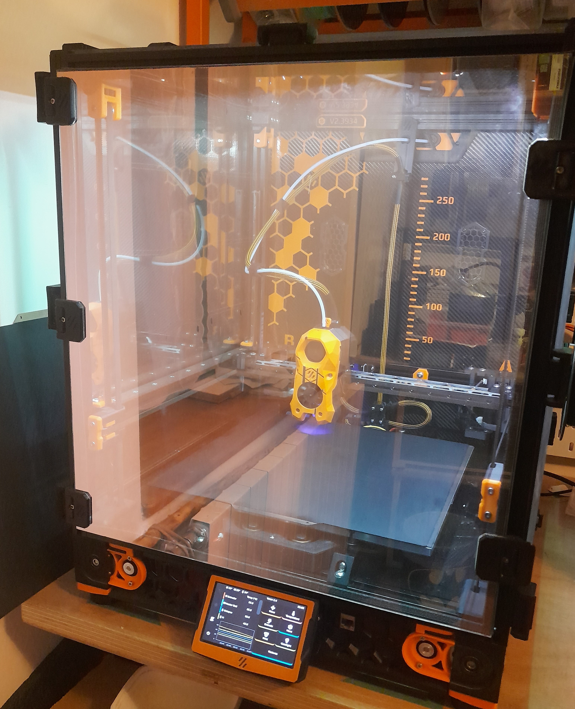

# V2.3934 #
Mods and useful macros for Voron 2.4

For now the printer is not stock anymore:
- ~~Klicky~~  Euclid probe
- Eiffel X beam by elpopo
- Bambulab A1 Nozzle brush
- 24v warm/cold leds for caselight
- ~~rama pinned front idlers~~ BFI M3
- [XY pinned mod by Hartk](https://github.com/hartk1213/MISC/tree/main/Voron%20Mods/Voron%202-Trident/2.4/Voron2.4_Trident_Pins_Mod)
- ~~GE5C Z-joint~~ [Fixed Z joints by Thor](https://github.com/bythorsthunder/Voron_Mods/tree/main/Fixed_2.4_Z_Joints)
- X Y endstop relocation
- LGX lite with 2 part PCB + Belayed Mobius 4
- ~~[Filament runout sensor by Tircown](https://github.com/elpopo-eng/VoronFrenchUsers/tree/main/Mod/Filament_motion_sensor)~~
- Optotap Filament Switch & Motion Sensor 
- [LFZI by Falcon](https://github.com/falcon14141/Voron_Mods/tree/master/Lovely%20Frog%20Z%20Idler) 
- Another Umbilical toolhead / No Z chain / PUG
- Stealthmax filter
- 5mm panel + solar film / Monodoor magnetic hinges
- Peek-a-Boo for Waveshare 4.3" TFT




> [!NOTE]
> I don't publish full config anymore, only useful or original macros
> that you need to adapt to your config.

## Klipper config ##

Entire configuration of My Voron 2.4 printer
was inspired by the great Voron User Community

Many scripts are unmodified from shared configuration on github, See list of authors below 
[Frix_x/Klipper-voron-V2](https://github.com/Frix-x/klipper-voron-V2),
[MapleLeafMakers/Klippermacros](https://github.com/MapleLeafMakers/KlipperMacros),
[jlas1/Klicky-Probe](https://github.com/jlas1/Klicky-Probe).

Some are inspired by : Falcon14141, elpopo_eng, Ette

- ~~[print_start.cfg](./klipper_config/macros/print_base/print_start.cfg) : A two part print_start that let you interact with printer during heat soak (turn light on, homing, load filament ...)~~
- Well, two part print_start was a nice experiment BUT IT WAS A BAD IDEA !! As long as you put QGL, BED_MESH , wathever in a delayed gcode, errors will not be triggered in the same queue. When an error occurs printer will just abord Delayed_gcode an will continue on virtual_sdcard.

Workaround : Separate warmup actions and motion actions. Use an interactive PRINTER_WARMUP (containing BEDSOAK, CHAMBERSOAK, EXTRUDER_PREHEAT ), then call the non interactive PRINT_START.  I use these line in SuperSlicer start g-code
```
PRINTER_WARMUP
PRINT_START SIZE={first_layer_print_min[0]}_{first_layer_print_min[1]}_{first_layer_print_max[0]}_{first_layer_print_max[1]}
```

Comments on printer.cfg link the authors or source of inspiration.  

### Original ideas (no the best) : ###
- ~~[DB_FILAMENT](./klipper_config/macros/db_settings/)  (previously material.cfg) (filament management, store parameters et apply it: _eg. pressure_advance, extrude_factor..._ )
Those parameters are called from print_start, calibration macros, ...~~
DB_FILAMENT is outdated, I use [KBobine](https://github.com/fbeauKmi/kbobine_filament_settings) instead.

### Recently added : ###
- ~~[max_flow.cfg](./klipper_config/macros/calibration/max_flow_calibrate.cfg) a macro to check max_flow ~~with a filament_motion_sensor or ERCF~~~~ **Deprecated**, I use a klipper module [max_flow.py](https://github.com/fbeauKmi/kbobine_filament_settings/tree/develop/klipper/klippy/plugins) instead.I doesn't need slicer trick as previously.
- Separate config file for hotends and extruders, add max_flow check for PRESSURE_NOZZLE and PRIME_LINE
- ~~[chamber.cfg](./klipper_config/macros/heating/chamber.cfg)
Wait chamber to reach target temperature. Async mode~~
- [inconsistent_test](./klipper_config/macros/calibration/inconsistent_test.cfg): 
Print a 1 wall spiralized trapezoid, to check extruder issue see https://mihaidesigns.com/pages/inconsistent-extrusion-test
- [heatsoak.cfg](./klipper_config/macros/hardware_functions/heating/heatsoak.cfg) . Turn heater on and Wait until stability on chamber_temp is reached.
Main feature is to evaluate smoothed derivative of heater_bed power to determine end of bed soak. to do so it use quadratic first derivative polynomial filter from [Savitzky-Golay](https://en.wikipedia.org/wiki/Savitzky%E2%80%93Golay_filter). Once bed power is stable print can start.


Why quadratic ? Because convolution factors are quite easy to compute. I also tried cubic ones, but it produces sometimes inflexion values that yield to unwanted results.
It's asynchronous macro. that let you interact with printer during soak (even interrupt manualy bed soak) when called from a file.
Original idea came from French channel on Discord Voron Design. 

## [Mods for V2.4](./mods)

A collection of mods I designed or adapted to my printer

- [Another toolhead umbilical](./mods/another_toolhead_umbilical/) for V2.4
- [Bambulab Toolhead for Stealthburner](./mods/bambulab_th_for_SB/)
- [Belayed Mobius M4](./mods/belayed_mobius_extruder/)
- [BME280 mount](./mods/bme280_extrusion_mount/)
- [Corner insulation for 2020 extrusion](./mods/corner_insulation/)
- [Exhaust_cover](./mods/exhaust_cover/) : Cover plate for exhaust, I use it while printing ABS
- [Fan_grid](./mods/fan_grid/) : (parametric) more secure fan grid for Voron 2.4 skirt
- [Foldable cable path](./mods/foldable_cable_path/)
- [Magnetic door hinge](./mods/magnetic_door_hinge/) : Parametric door hinge
- [Magnetic One Door Handle](./mods/magnetic_onedoor_handle/)
- [No_Z_Chain](./mods/no_z_chain/)
- [Nozzle cleaner and bucket](./mods/nozzle_cleaner/)
- [Parametric extrusion mount](./mods/parametric_extrusion_mount/)
- [Peek-a-boo](./mods/peek-a-boo/) Storable display mount for V2.4/trident
- [PiPlate for Waveshare CM4 Base](./mods/piplate_WS_CM4_base/)
- [PUG](./mods/PUG/)
- [Rear panel vinyl cutout](./mods/backplate/)
- [SB cutter Jig](./mods/SB_cutter_jig/)
- [Serial_plate](./mods/serial_plate) : Smaller serial plate for 2020 extrusion (no screws)
- [Skin Stealthburner](./mods/skin_stealthburner/) : Dual color face for Stealthburner (M600)
- [Spool roller](./mods/spool_roller/)
- [Stealthmax bowden side entry and intake mod](./mods/stealthmax_mods/)


## Acknowledgements

Many thanks to the voron french community #honhonbaguette.

Feel free to use, share, modify this files for your need as long as you respect License from their respective authors

Let me know if there is mistakes, errors or omissions. 
