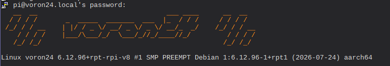

# Simple custom SSH welcome for Voron printer



Install `figlet` on your SBC

``` sudo apt install figlet ```

Copy [`00-header`](./etc/update-motd.d/00-header) to `/etc/update-motd.d` 

ssh will display SMSLANT style hotname + Voron logos at startup.

Enjoy it ! ;)