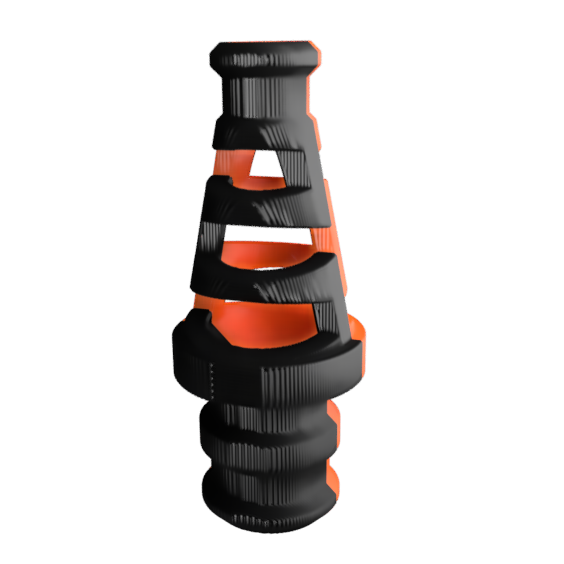
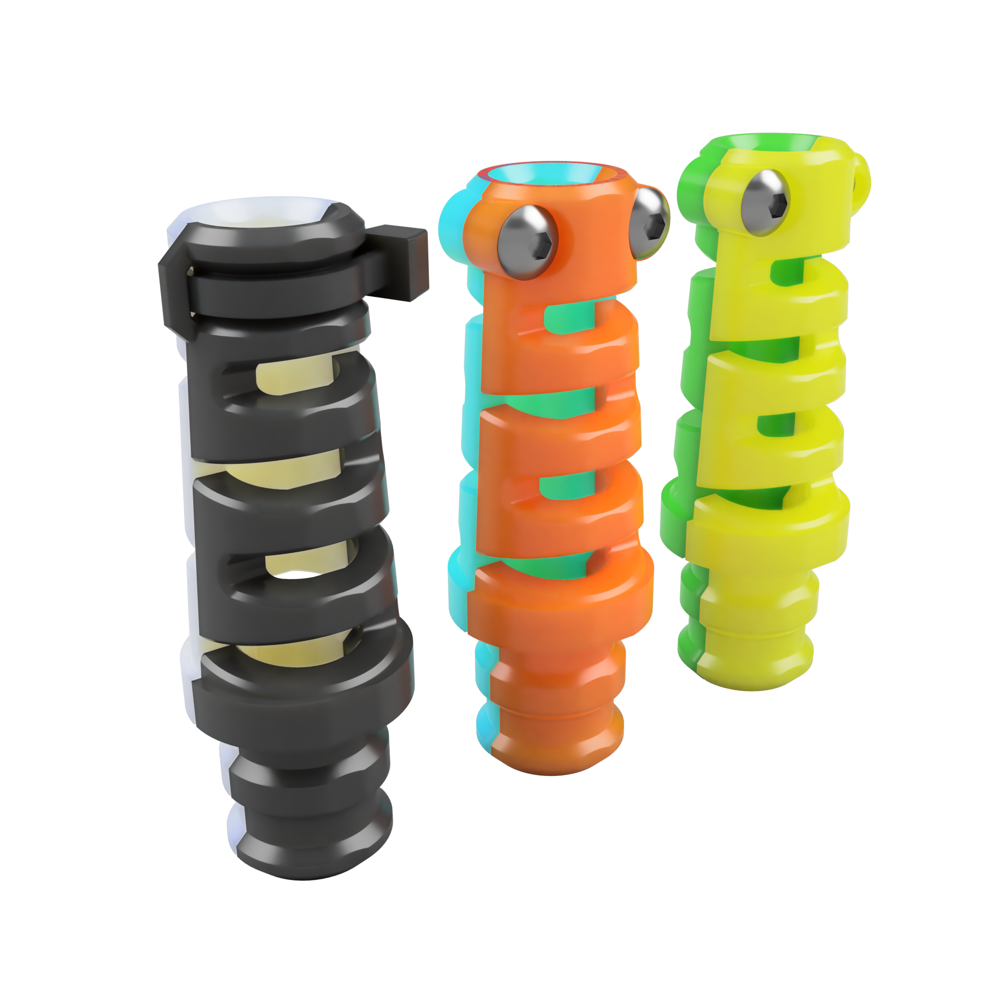
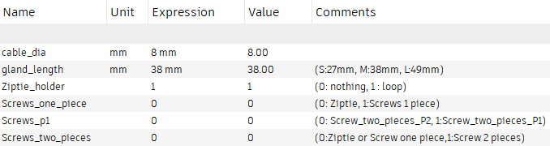

## The PUG
PUG stands for Parametric (or Printed) Umbilical (or Universal) Gland ^^.

I use PUG to replace PG7 on my printer. Why ?

- It suits cables from **4.5mm** to **10mm** in diameter.
- it is easy to print and _re-print_, ...
- it allows to easily remove the cable 

## How to print it ?

ABS/ASA (not filled), no support, 4 perimeters, 5 top/bottom layers, 40% infill. Print a bit hotter than usual (+5°c)

If you plan to use it in unenclosed printer, you could consider PETG for better layer adhesion.

## Is it reliable ? 

I have no issue with the current version. To ensure reliabity, print hot enough to avoid delamination. Avoid filled filament CF or GF

## Don't want to use Ziptie ?

Two "screws" version exists
- One piece : print twice the same piece, screws are at opposite sides
- Two piece : print 2 different pieces, screws are one sided. 

## Build PUG as you need

There is 180 STLs of PUG but if you don't find the suitable one, a Fusion360 file allow you to build your own PUG.
Open the ``PUG.f3d``, then got to ``modify/change Parameters``

_Comments column_ shows recommended values but you can try different settings.

|  |
| :-------------------------------------------------: |
|               _Fusion 360 parameters_                |

- ``Cable_dia`` = Cable diameter
- ``gland_length`` = length of the "visible" part of the PUG

Other parameters are a bit tricky as F360 do not accept conditionnal parameters

- ``Ziptie holder`` = 1 to add a loop that maintain ziptie (let 0 if screw option are in use)
- ``Screws_one_piece`` = 1 to get screws on opposite sides
- ``screws_two_pieces`` = 1 to get screws one side
- ``screws_p1`` =  1 for part 1 , 0 for part 2 of ``screws_two_pieces``

> The timeline can show some errors : don't care about it. It should not affect final render.
