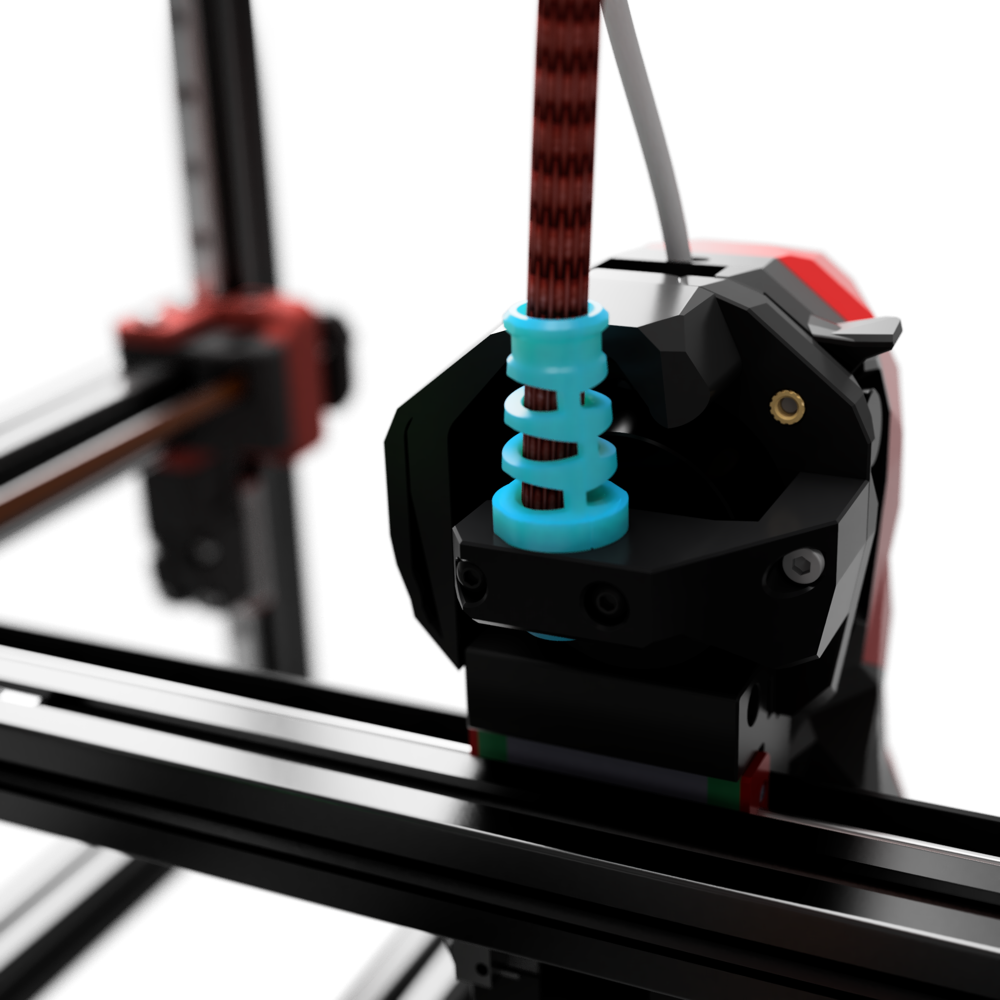

# PUG holder for CW2 / LGX Lite

## Nice feature

No need to disassemble the wire harness to install this gland.
 
## Bill of Materials
 
| Category |  Qty  | Description          | Notes     |
| :------- | :---: | :------------------- | :-------- |
| Hardware |   3   | M3 heat insert       | Voron BOM |
| Hardware |   2   | M3x10 SHCS           |
| Hardware |   1   | Ziptie (3mm x 100mm) |