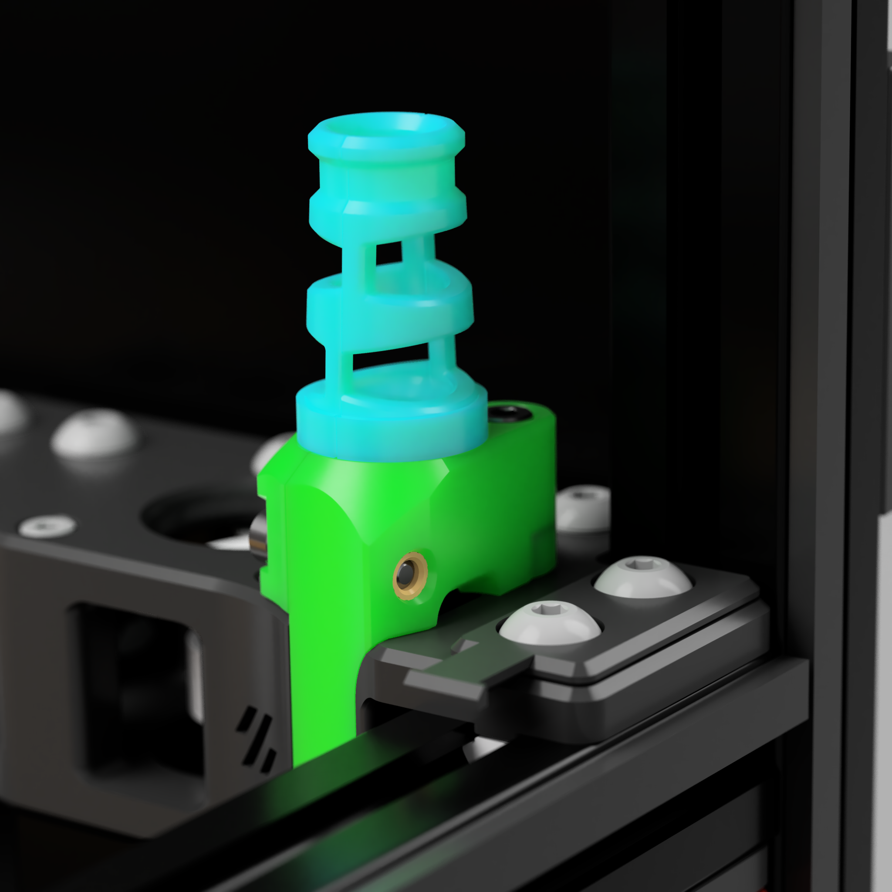

## Trident A Stepper mount for PUG

### How to install it ?

Install heat insert in P1
Insert PUG and cable
close the holders and lock with screw 
Install the plate on A-drive 
Enjoy !

 
### Bill of Materials
 
| Category | Qty | Description          | Notes  |
| -------- | --- | -------------------- | ------ |
| Hardware | 2   | M3x18 SHCS           |        |
| Hardware | 1   | Heat insert          | M3 5x4 |
| Hardware | 1   | Ziptie (3mm x 100mm) |