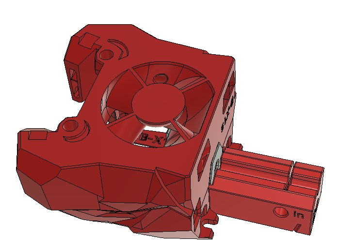

# Stealthburner cutter jig
## Aim :

*“Simpler is better”*

The length of bowden in Voron Stealthburner depends of your toolhead and extruder mount. That why i design so many different size.  I made it for SB but I suppose it can work with other TH
 
## Common lengthes : 
 

The lengthes below are examples, check the CAD of your extruder mount or measure it with a caliper to get the exact lenth of your bowden.   

- CW2, LGX/LGX lite (with ERCF sensor) : 11mm
- LGX/LGX lite (without ERCF sensor) : 19mm

## Usage:

- Insert bowden in the hole of the jig. Use a cutter blade in the 45° cut , turn the bowden to form the tip.

- Insert bowden in the toolhead and use the cutter with the appropriate length.
