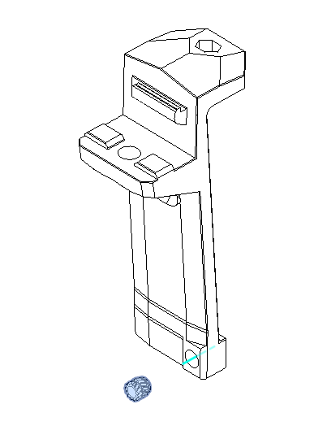
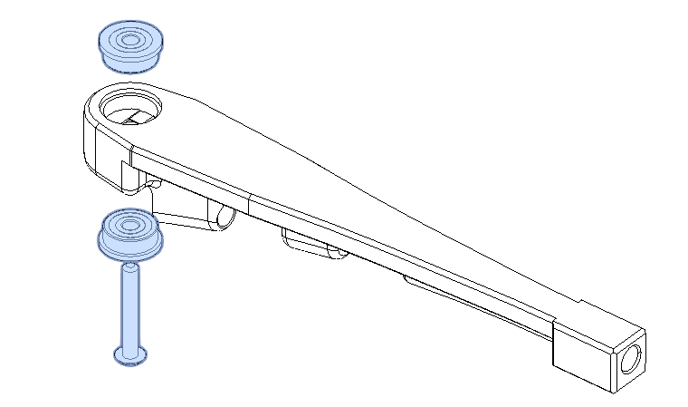
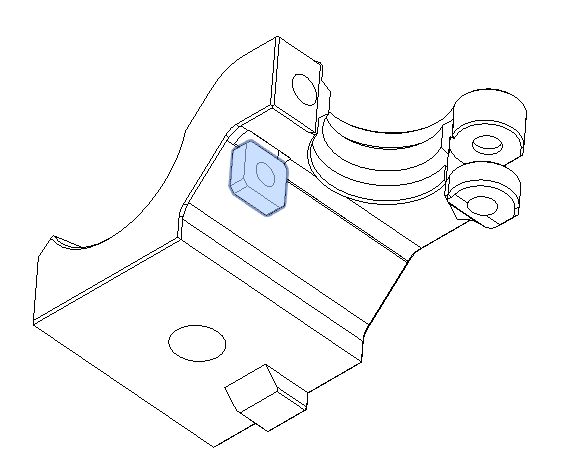
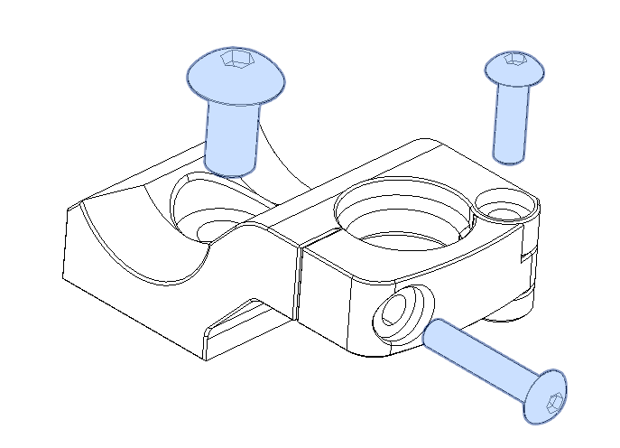

# Another toolhead umbilical for Voron 2.4

Here's the second version of my umbilical mount. This version was designed in collaboration with __@stephzic__.

|  | 
| :-----------------------------------------------: | 
|         _This is the previous version ^^_         |

## How does it differ from the mount on the A motor?
Initially, this design was not intended for CANbus, but a 16-wire cable. However, a CAN cable can be used perfectly well. The 2 parts of the mount hold the cable taut between the top and bottom extrusions. The cable then enters the electrical cabinet next to the Z chain. 
 
### Pros: 
- the cable does not interfere with the bowden tube when the carriage is in the up position
- the mount is suitable for all cable diameters (4.5mm to 10mm)
- the cable does not run alongside the steppers (limits EMI)
- rear panel remains easy to remove
  
### Cons:
- haven't found any yet ^^

## Changelog
- V1 : initial version
- V2 : 
  - Stronger top holder, 
  - review geometry, 
  - maintain clamp in place, 
  - allow to use most exhaust cover,
  -  suitable for 4.5 to 10mm cable dia, 
  -  add a bowden guide (by @stephzic),
  -  review bottom holder geometry to suit No-chain mod (to come)    
## Printed parts
The main parts are printed in ABS with VORON specifications (40% infill, 4 perimeters, ...). The cable-holding inserts are made of TPU95A (tested for several months without issue in a 65°C chamber). An ABS version of the insert (untested yet) is available in STLs.

## Bill of materials
| Hardware             | Qty | notes            |
| -------------------- | --- | ---------------- |
| M3x16 BHCS           | 2   |
| M5x10 BHCS           | 2   |
| M3x4x5 heated insert | 1   |
| M3 **square** nut    | 1   | DIN562           |
| M5 T-nut             | 2   |
| F623RS Bearing       | 2   | for bowden guide |
| M3x20 BHCS           | 1   | for bowden guide |
| M3 hex nut           | 1   | for bowden guide |

## Assembly instructions

### Top holder

#### (Optional bowden holder)

> Mount this assembly on the center of the top rear extrusion with a M5x10 screw

### Bottom holder

> **DO NOT mount it on the gantry !**  
> Mount this assembly on the center of the bottom rear extrusion with a M5x10 screw.

Use TPU or ABS insert in the holder according to your cable diameter.

## Notes on Umbilical cable

As umbilical, I use a 14-wire harness from LDO + 2 22AWG wire, MDPC-X Medium cable sleave and heat shrink. All together it measures 8 mm in diameter

## Associated mods
- [PUG](../PUG/)
- [exhaust cover](https://www.printables.com/model/412144-voron-24-exhaust-cover)
  
## Aknowledgements

@stephzic for the great help on the developpement of this mod and his contribution. bowden guide was inspired by [Galvanic bowden tube guide](https://github.com/VoronDesign/VoronUsers/tree/master/printer_mods/Galvanic/Bowden_Tube_Guide) 

Many thanks to the French Voron Community to support me everyday ^^

