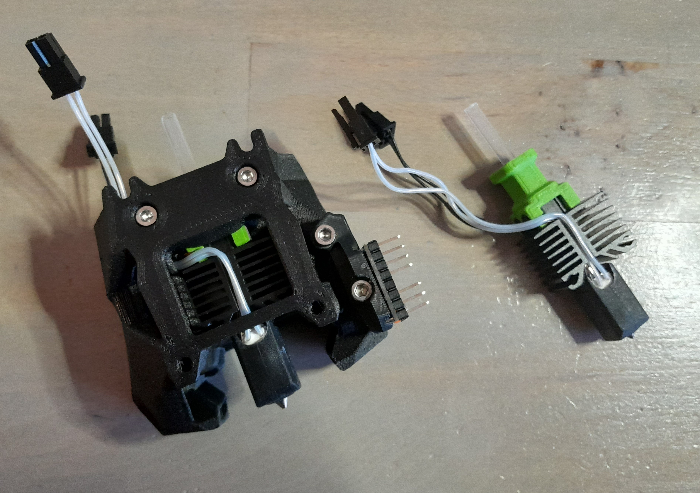

# Bambulab Toolhead for Stealthburner #
No need to explain, all is in the title.

Based on [Voron Stealthburner for Bambu Lab X1C/X1 Hotend by MrTelip](https://www.printables.com/fr/model/323196-voron-stealthburner-for-bambu-lab-x1cx1-hotend)

## But Why ?? ##

Bambulab toolhead is cheap, fast to heat up/down (40s from 25°C to 270°C), had great max flow. Exists in stainless steel ans hardened steel.

## What is bad ? ##

The cables are pretty short.

## This mod vs MrTelip version ##

- Revert toolhead (back/front) to optimize cable length 
- Add a cable path
- Add coding in toolhead holder
- TAP complient

## Bill of Materials ##

|Category|Qty|Description|Notes|
|:----|:----|:----|:----|
|Hardware|4|M3 Heatset Insert|Standard Voron spec 4.7 mm diameter inserts|
|Hardware|2|M3 nut|DIN562 (square)|
|Hardware|1|Bambulab Toolhead||
|Hardware|2|Bambulab Toolhead screw||
|Hardware|1|Bambulab Heater||
|Hardware|1|Bambulab thermistor||
|Hardware|1|Bambulab sock||
|Hardware|2|M3 x 16 SHCS|Socket head cap screw|
|Hardware|1|Microfit 3.0 2 pins|depends on the way you plug the TH|
