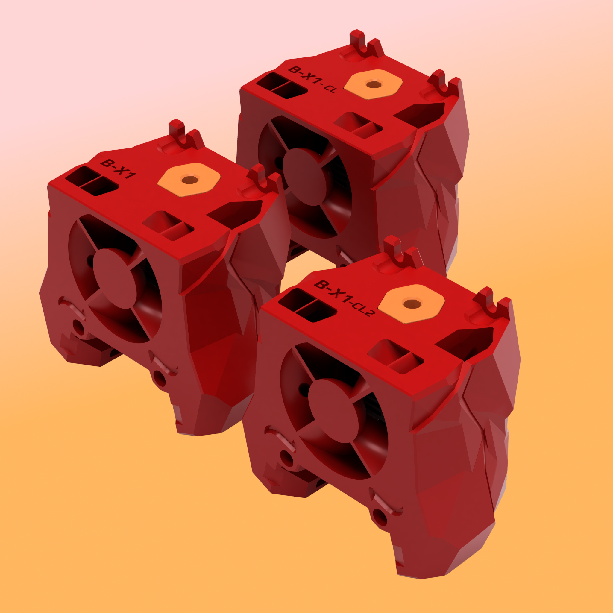

# Bambulab Toolhead for Stealthburner #
No need to explain, all is in the title.

Based on [Voron Stealthburner for Bambu Lab X1C/X1 Hotend by MrTelip](https://www.printables.com/fr/model/323196-voron-stealthburner-for-bambu-lab-x1cx1-hotend)

## Update 12/11/2023 :
- Too many versions ! attempt to simplify choice table
- Fix airflow for “clone + std V6 nozzle”

## Update 02/11/2023 : 
- Add version to use M3x16 SHCS instead of original EEL screws  
## Update 12/05/2023 : ##
- fix TH_holder clearance (Users reports not enough clearance , Thanks elpopo, LC49 )
## Update 22/02/2023 : ##
- Add a version HE 2mm higher (for Ali clone with CHT nozzle. Suggestion of @Controllore)
## Update 08/01/2023 ##
A user report problems with square nuts thicker than the DIN562, so I made a version for this.

3 possibilities :

| Nuts thickness | Screws              | Hotend                     | parts to print                                                                                                                                                                                                                                                   |
| :------------- | :------------------ | :------------------------- | :--------------------------------------------------------------------------------------------------------------------------------------------------------------------------------------------------------------------------------------------------------------- |
| <1.8 mm        | BBL screws **only** | Original BBL Clone     | [[a]_SB_bambulab_TH_holder_r6.stl](./STLs/[a]_SB_bambulab_TH_holder_r6.stl)   [SB_bambulab_TH_front_r3.stl](./STLs/SB_Bambulab_TH_front_r3.stl)  [SB_bambulab_TH_rear_CW2_r3.stl](./STLs/SB_Bambulab_TH_rear_CW2_r3.stl)                                 |
| <2.4 mm        | M3x16 SHCS          | Original BBL Clone     | [[a]_SB_bambulab_TH_holder_r6.stl](./STLs/[a]_SB_bambulab_TH_holder_r6.stl)   [SB_bambulab_TH_front_clone.stl](./STLs/SB_Bambulab_TH_front_clone.stl)  [SB_bambulab_TH_rear_CW2_clone.stl](./STLs/SB_Bambulab_TH_rear_CW2_clone.stl)                     |
| <2.4 mm        | M3x16 SHCS          | Clone + V6 standard nozzle | [[a]_SB_bambulab_TH_holder_r6_2mm](./STLs/[a]_SB_bambulab_TH_holder_r6_2mm.stl)   [SB_bambulab_TH_front_clone_2mm.stl](./STLs/SB_Bambulab_TH_front_clone_2mm.stl)  [SB_bambulab_TH_rear_CW2_clone_2mm.stl](./STLs/SB_Bambulab_TH_rear_CW2_clone_2mm.stl) |

## But Why ?? ##

Bambulab toolhead is cheap, fast to heat up/down (40s from 25°C to 270°C), had great max flow. Exists in stainless steel ans hardened steel.

## What is bad ? ##

The cables are pretty short.

## This mod vs MrTelip version ##

- Fix screw holes position 
- Revert toolhead (back/front) to optimize cable length 
- Add a cable path
- Add coding in toolhead holder
- TAP complient

## Bill of Materials ##

| Category | Qty  | Description             | Notes                                       |
| :------- | :--- | :---------------------- | :------------------------------------------ |
| Hardware | 4    | M3 Heatset Insert       | Standard Voron spec 4.7 mm diameter inserts |
| Hardware | 2    | M3 nut                  | DIN562 (square)                             |
| Hardware | 1    | Bambulab Toolhead       |                                             |
| Hardware | 2    | Bambulab Toolhead screw |                                             |
| Hardware | 1    | Bambulab Heater         |                                             |
| Hardware | 1    | Bambulab thermistor     |                                             |
| Hardware | 1    | Bambulab sock           |                                             |
| Hardware | 2    | M3 x 16 SHCS            | Socket head cap screw                       |
| Hardware | 1    | Microfit 3.0 2 pins     | depends on the way you plug the TH          |
