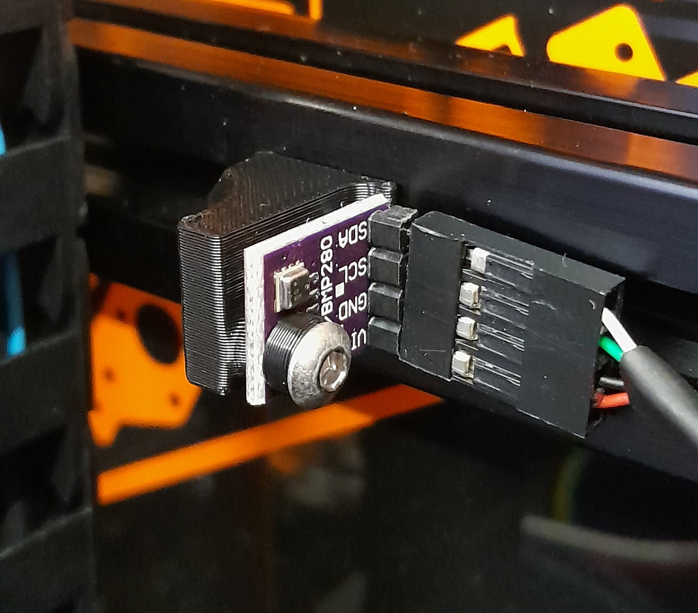

## BME280 mount

BME280 is a temperature sensor, it also gives humidity and pressure. I use it as chamber temperature sensor in my Voron 2.4. 



There is several form factor, be careful to have the one on picture to use this mount
 

 (eg. https://www.amazon.com/KeeYees-Temperature-Humidity-Atmospheric-Barometric/dp/B07KYJNFMD)
## Klipper Configuration

### Plugged on Pi :

```
[mcu rpi]
serial: /tmp/klipper_host_mcu

[temperature_sensor chamber]
sensor_type: BME280
i2c_address: 118
i2c_mcu: rpi
i2c_bus: i2c.1
```

### Plugged on BTT Octopus (PA8/PA9):
i2c_bus is not well documented , you can find it in source of klipper: for example BTT Octopus has STM32 cpu , look at https://github.com/Klipper3d/klipper/blob/master/src/stm32/i2c.c

```
[temperature_sensor chamber]
sensor_type: BME280
i2c_address: 118
i2c_bus: i2c1a
```

## Bill of materials
| Category | Qty | Description    | Notes                   |
| -------- | --- | -------------- | ----------------------- |
| Hardware | 1   | BME sensor     |
| Hardware | 2   | M3x8 BHCS      |
| Hardware | 1   | M3 T-nut       | for 2020 extrusion V2.4 |
| Hardware | 1   | M3 Drop-in nut | See DIY Drop-in nuts    |