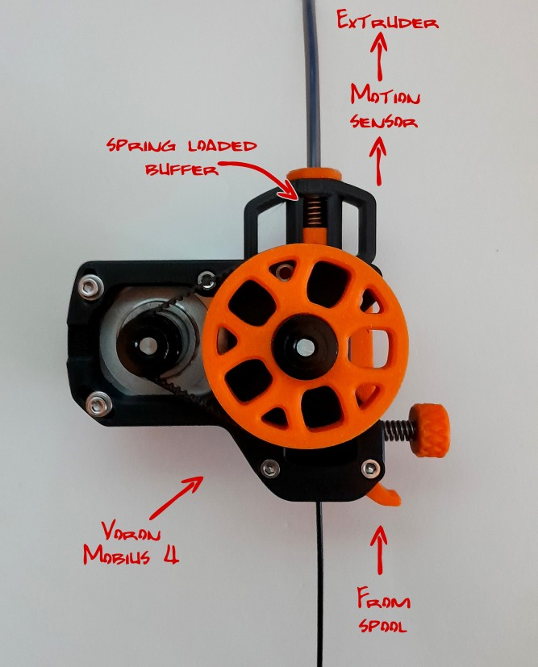

## Buffered Voron Mobius extruder

Add a spring loaded buffer to M4 to help keep synchronized extruder and extruder_stepper, Original model can be found on [Mobius-extruder](https://github.com/VoronDesign/Mobius-Extruder) repository.
The spring helps to keep filament pressure in reverse bowden.  

Only modified files are shared on this repo, others can be found at the links above.

For software configuration, it uses belay module included in Danger Klipper, see [example config](./config/buffer_extruder.cfg)

This mod was inpsired by Annex [Belay](https://github.com/Annex-Engineering/Belay)

