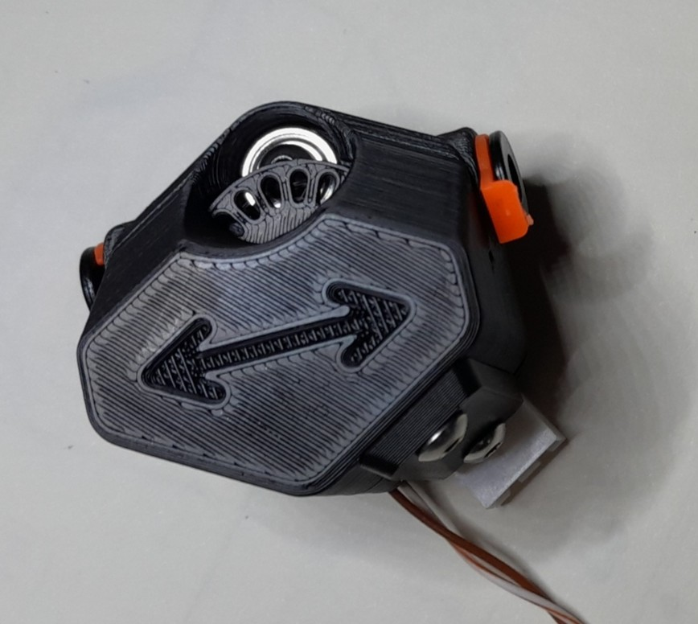
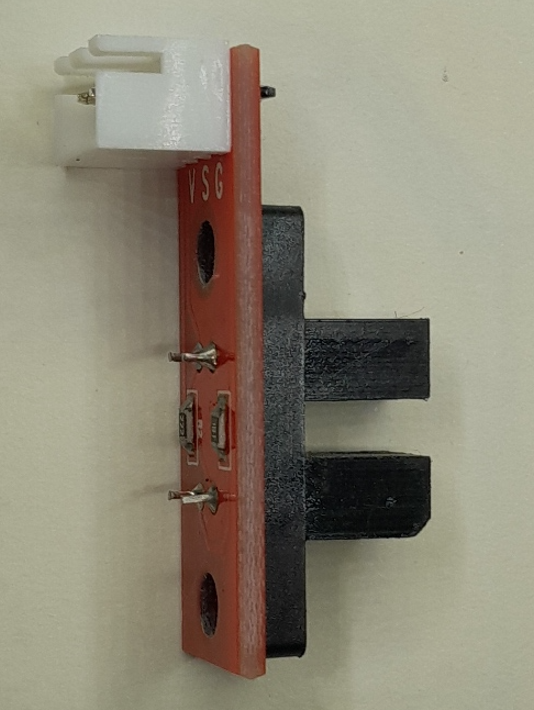
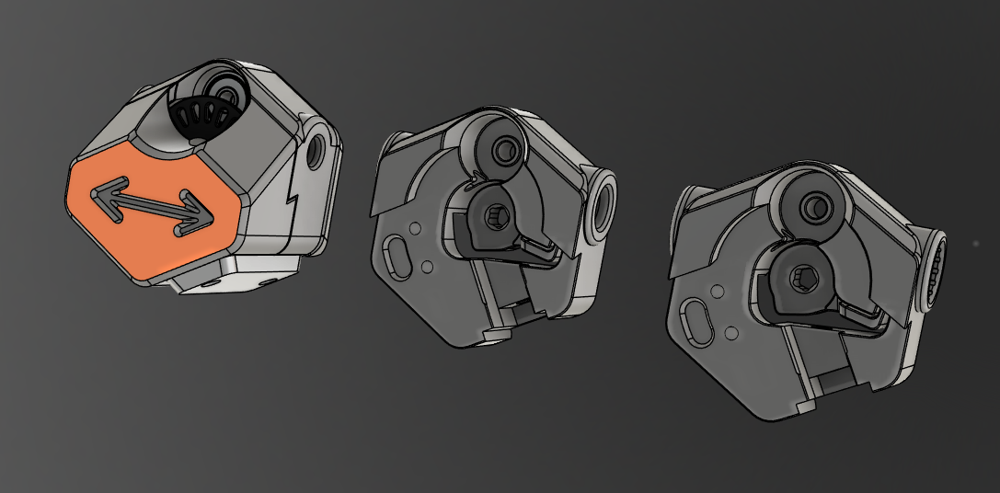

# Cheappo Filament sensor

This is a lowcost version of [Optotap_filament_sensor](../optotap_filament_sensor/README.md).
It combines a ``filament switch sensor`` and a ``filament motion sensor`` but also can be used as encoder in Multimaterial Units.

The ``filament motion sensor`` precision is around 1.5mm.

As [Optotap_filament_sensor](../optotap_filament_sensor/README.md), there's is version for bontech collet, UM2 or Ecas04 

The BOM price is estimated to less than $4. Actually, I can build around 10 of this with the material sourced.

## Bill of materials 

| Hardware                              | qty | Notes                                                                   |
|:--------------------------------------|----:|-------------------------------------------------------------------------|
| Optical endstop                       | 1   | PBC size is 33x10mm, e.g https://bulkman3d.com/product/optical-endstop/ |
| pin D3 20mm                           | 1   | e.g : 3.0x20mm BMG kit shaft                                            |
| 623zz bearing 3x10x4 mm               | 1   |                                                                         |
| EPDM rubber O-ring #5 (5.7mm x 1.9mm) | 2   | Any OD10mm CS2mm should work, ! EPDM  not Silicon                       |
| M3 x 10 BHCS                          | 2   |                                                                         |
| M3 x 16 BHCS                          | 1   | M3 x 16 if you wan't to screw it to the frame                           |
| Pushfit collet                        | 2   | bondtech, UM2 or ECAS04                                                 |
| D2F type microswith                   | 1   |                                                                         |
| M2 x 10 self tapping screw            | 2   |                                                                         |
| JST-PH 2P header                      | 1   |                                                                         |
| Isopropylic Alcohol (IPA)             |     | ! Important : Clean o-rings with IPA to give enough grip                |

See [Optotap_filament_sensor](../optotap_filament_sensor/README.md) for print settings, assembly and Klipper config