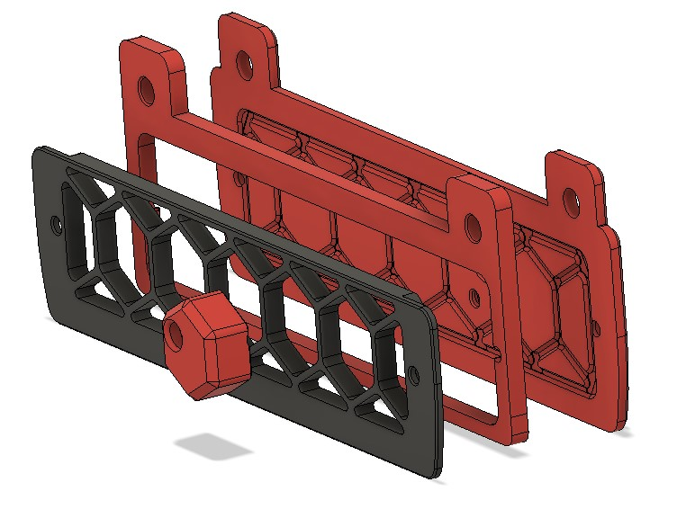

Yes, this is another backpanel cover for Voron 2.4 ! I designed it to use with my umbilical top mount and bowden side entry.
 
## How to print it ?

`exhaust_cover_spacer.stl` must be scale in Z in your slicer to the backpanel thickness
if you want left side output print  `exhaust_cover_right_bowden_output.stl` as mirror
     

## Install it.

4 printed parts are needed (I know there is only 3 in this repo), the fourth is the original grid from Voron 2.4R2 (https://github.com/VoronDesign/Voron-2/blob/Voron2.4/STLs/Exhaust_Filter/exhaust_filter_grill.stl).

VHB, foam or nothing : Use whatever you want to fix it

## Bill of materials

Original Exhaust filter hardware should be enough. Below fine extra harware
| Hardware | Qty  | Notes |
| -------- | ---- | ----- |
| M3x8     | BHCS | 1     |
## Known issue

(Fixed by exhaust_cover_right_bowden_output_v2)

The original Voron grid can be a bit thicker with thinner panel : Two options, cut your grid with a blade or reprint cutting at desired height in your slicer
