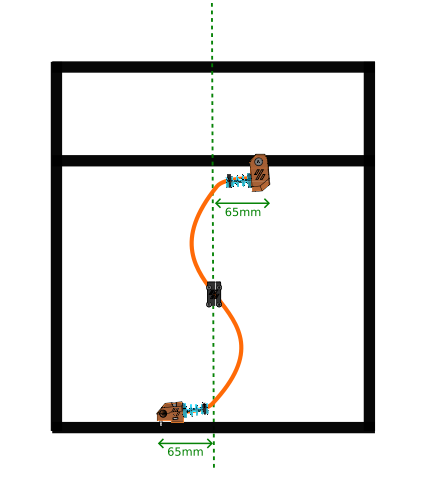
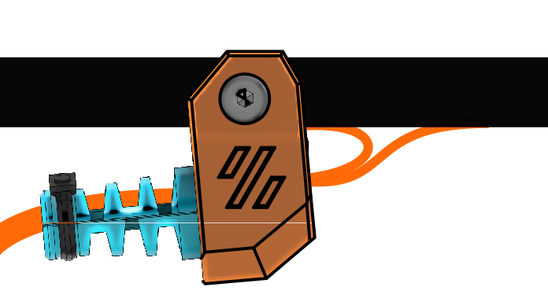
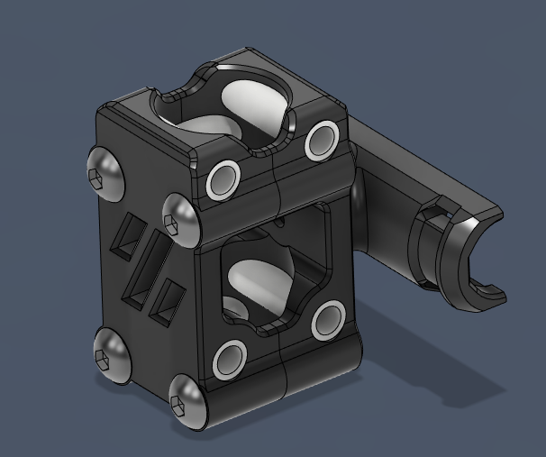

# No Z Chain for Voron 2.4

This mod was designed to remove Z-chain by a Z umbilical. [another umbilical toolhead](../another_toolhead_umbilical/) is required for this mod. TH umbilical is used as guide for Z 

This is still a draft, use it with care and feel free to contact me for any error or omission.

## Is there any benefits with this mod ?
There is no longer a chain above the gantry, but the toolhead umbilical remains and can be a problem for some mounts.
Changing or adding cable in the umbilical can be a pity.

**Keep in mind you do it only for Style !** ^^
## Bill of materials

| Hardware                   |      qty | Notes                                                                                                            |
| :------------------------- | -------: | ---------------------------------------------------------------------------------------------------------------- |
| cable sleeve MDPC-X Medium |    ~2-3m | [www.cable-sleeving.com](https://www.cable-sleeving.com/cable-sleeving-m)                                        |
| cable sleeve MDPC-X small  |    ~1-2m | [www.cable-sleeving.com](https://www.cable-sleeving.com/cable-sleeving-s)                                        |
| heatshrink 16mm            |    ~15cm | ratio 3:1 or better                                                                                              |
| heatshrink 8mm             |    ~20cm | ratio 3:1 or better                                                                                              |
| PTFE tube OD4mm            | 8 x 16mm |                                                                                                                  |
| 6x3mm Neodym magnets       |        2 | N52 is better but N35 should but fine                                                                            |
| M3 T-Nut                   |        1 |
| M5 T-nut                   |        1 |
| M3 x 20 BHCS               |        4 | SHCS should be OK                                                                                                |
| M3 x 16 SHCS               |        4 |
| M3 x 10 SHCS               |        1 |
| M5 x 10 BHCS               |        1 |
| M3 Square nut              |        4 | DIN562 - max thickness 1.7mm                                                                                     |
| Ziptie 3mm small           |        2 |
| [PUG](../PUG/)             |        2 | Shorter is better, diameter depends on your wire harness, You can use ziptie or screw version, it doesn't matter |

## Before the assembly

Prepare the wire harness. The overall length depends on your printer size.
To determine cable and cable sleeve length, put the gantry at the max z position and refer the sketches below. 
|  |
| :----------------------------------: |
|        _S-shape of the cable_        |

|  |
| :----------------------------------------: |
|          _Preparing wire harness_  
This is a example but you can add much more cable as long as total diameter does not exceed 10mm        |
 
 Once harness is ready choose Pug against central part diameter 
 
 > Steppers cable length is about the same as in Z chain. 

## Printed parts
All parts should be printed with Voron specifications.  

 ! Do not change STLs orientation !

## Assembly

1. Install M3 square nuts in the following parts. Attach PUG_gantry_mount_front to the gantry and PUG_bottom_mount_base to the bottom extrusion
2. Present wire harness and PUGs. The PUG_gantry_mount is designed to let stepper be routed inside extrusion slot (see figure below)
   
 

3. Fix PUGs with PUG_gantry_mount_back and PUG_bottom_mount_top and M3x16 SHCS 
4. Insert magnets in central part slots
5. Assemble parts around TH umbilical
    

## Issues

TO BE COMPLETED BY USERS