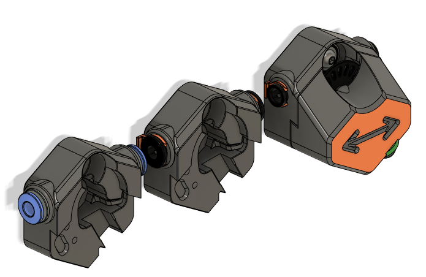
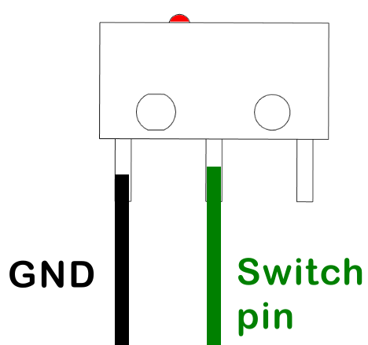
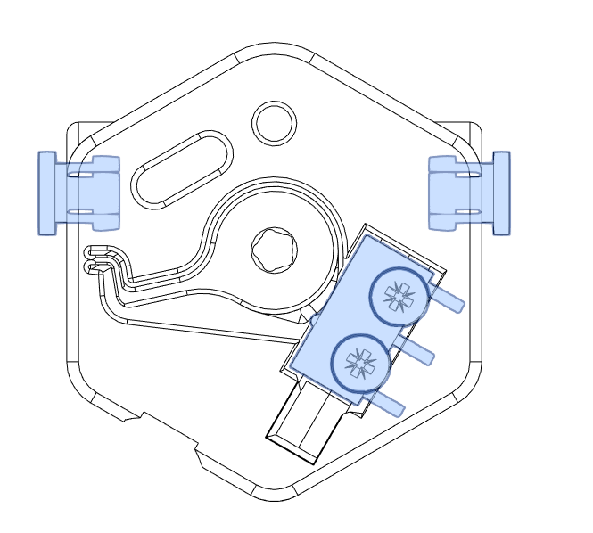
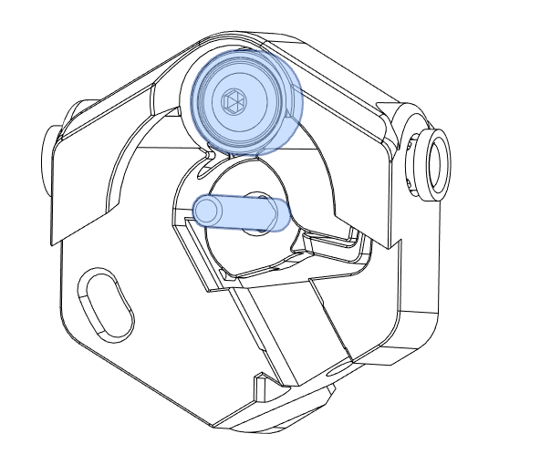
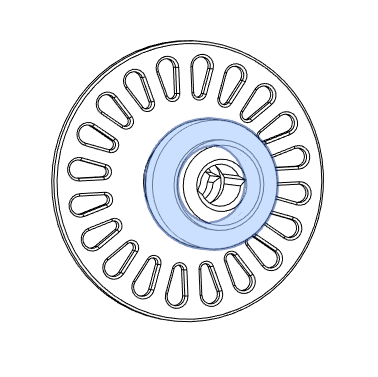
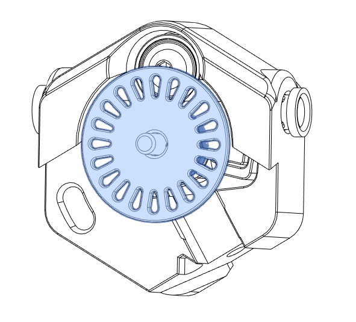
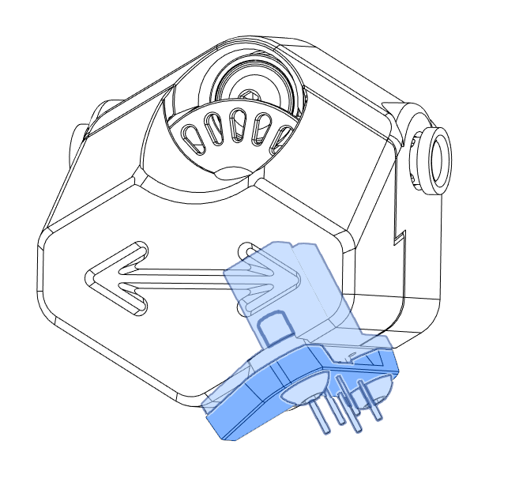

# Optotap filament sensors

> [!NOTE] This document is a draft

Upcycle your Optotap PCB building a 2 in 1 filament sensor. 
This mod combines a ``filament switch sensor`` and a ``filament motion sensor``.

## Bill of materials 

| Hardware                              |  qty | Notes                                                    |
| :------------------------------------ | ---: | -------------------------------------------------------- |
| Optotap PCB 5v or 24 V                |    1 |
| pin D3 20mm                           |    1 | e.g : 3.0x20mm BMG kit shaft                             |
| 623zz bearing 3x10x4 mm               |    1 |
| EPDM rubber O-ring #5 (5.7mm x 1.9mm) |    2 | Any OD10mm CS2mm should work, ! EPDM  not Silicon        |
| M3 x 8 BHCS                           |    2 |
| M3 x 10 BHCS                          |    1 | M3 x 16 if you wan't to screw it to the frame            |
| Pushfit collet                        |    2 | bondtech, UM2 or ECAS04                                  |
| D2F microswith                        |    1 |
| M2 x 10 self tapping screw            |    2 |
| JST-PH 2P header                      |    1 |
| Isopropylic Alcohol (IPA)             |      | ! Important : Clean o-rings with IPA to give enough grip |

## Print parts

Parts are designed for ABS/ASA.  Use Voron print settings (LW0.4, LH0.2, 40% infill, 4 perimeters, 5 top/bottom layers) 

Three `FMS_back`  are available. It depends of the collet used. 

## Wiring

Switch must be be wired NO to an endstop pin of the board.

Switch GND and Optotap GND can be shared.

## Assembly
- Screw D2F microswitch in `FMS_back.stl` (Obviously, solder wires first. There's a room for JST-PH 2P header ).
- Insert collets

  

- Insert the shaft (tigh fit) . Attach the ball bearing with an M3x10.
  
  

- Put O-rings on the `Sensor_wheel.stl`
  
  

- Sensor wheel must run smoothly. If not, clean hole with a 3mm drill bit.
  
  

- place FMS_front and screws the optotap + cover whith M3x8 screws. 
  
  

- Check twice your wiring. Enjoy :) 

## Klipper configuration

Configure Microswitch as a `filament_switch_sensor`, Optotap as a `filament_motion_sensor`.

> [!TIP]
> DangerKlipper offers some extra features for filament sensors. see [Documentation](https://dangerklipper.io/Config_Reference.html#filament_switch_sensor)

See [optotap_fs.cfg](./config/optotap_fs.cfg) for a configuration example.