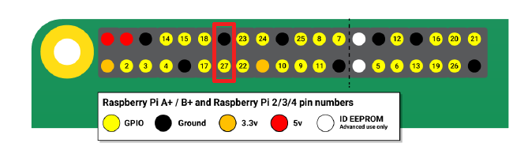
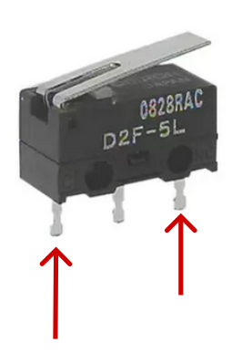

# Peek-a-boo display screensaver controller

This controller disable the display when the tray is closed. It has been tested on Raspian bullseye with Waveshare 4.3" DSI 2.8" DSI. 
It shouldn't work on other hardware.

## Hardware installation

Plug a NC (Normally close) wired D2F-5L microswitch, into GPIO27 + GND of the Pi 
| | |
|:-:|:-:|
|_Raspberry Pi pinout_|_D2F-5L NC_|

> [!TIP]
> If you want to use another pin you have to modify the ``button_pin`` value in ``klipperscreen_backlight.py``

## Software installation

The install script checks the compatibilty of system then installs ``xdotool`` package and service

Create a folder named ``Klipperscreen_backlight`` in home folder
```
mkdir ~/Klipperscreen_backlight
```
Copy ``klipperscreen_backlight.py`` and ``install.sh`` into it.
Run install script
```
cd Klipperscreen_backlight
bash ./install.sh
```
If everything is Ok you should not see error output on ssh terminal

**Congratulations!** Install is done. 

The display should go off when you close it then on when you open it.
