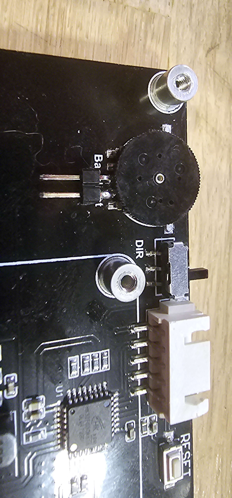

## Peek-a-Boo Display display mount for Waveshare or BTT 5.0" DSI by Falcon14141

### Downsides
- Need reprint front skirts (skirts for 2.4/trident see [CAD](./CAD/Peek-a-boo_5inch_multi_vendor%20v11.step) )
- Needs 95mm free space behind the skirt (+7mm compared to 4.3”)
- 10mm ground clearance when screen is open

### Assembly
Mostly follow the 4.3" guide to assemble this mod

### Control backlight for BTT
Hardcore mode: Dual microswitch and bypass of contrast adjustment potentiometer
- Solder a 2.54mm header to the potentiometer as shown in the photo.

- pass a 2-wire cable through the housing (same principle as the flex cable). use dupont connectors
- Solder the wires to the NO contact of an omron switch. Attach the switch on the other side of the one already in place (WS4.3 tutorial).
- connect the cable to the header in the box.
- Close the box and set the stop screw for the backlight's HW standby mode.