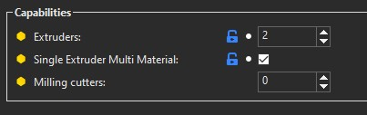
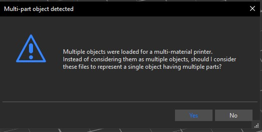
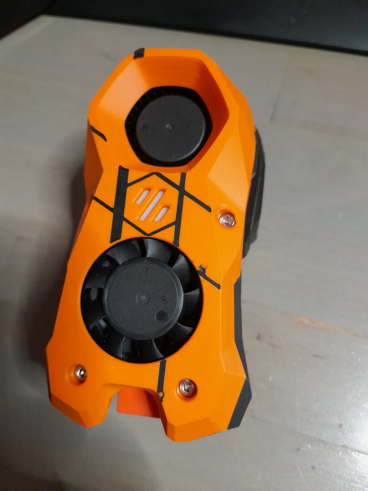

# Skin for Stealthburner #

This is a simple Skin Stealthburner toolhead. Using this idea [https://www.printables.com/fr/model/225153-voron-stealthburner-face](https://www.printables.com/fr/model/225153-voron-stealthburner-face).

## Drawing the pattern ##
The STL was produced with Freecad in few steps.
- Import the CAD of the Stealthburner main body (or the STL)
- Align a sketch to the bottom
- Draw the pattern you want
- Extrude 0.2mm
- Intersect with the main part
- Export result as STL (Freecad doesn't know 3mf)

## Slicing and printing the pattern ##
I did not use MMU at this time. [SuperSlicer](https://github.com/supermerill/SuperSlicer) is the right tool to slice multiple colors object.

### Configure SuperSlicer ###
If you have only one extruder in printer settings/General


In printer settings/Custom Gcodes/Tool change gcode add your own code. Mine is:
```
{if layer_num > -1 }
CHANGE_FILAMENT
FILAMENT NAME="{filament_preset[next_extruder]}"
{endif}
```
`if layer_num > -1` to avoid filament change at startup. FILAMENT_CHANGE is my macro for M600. FILAMENT NAME=... preload settings on the printer (see [db_filament.cfg](../../klipper_config/macros/helpers) )

### Import and slice ###

    Limitation : first layer should be 0.2mm height or less.

Import Main_body and skin at once. SuperSlicer will prompt you



Beware of the alignement of both objects. Adjust if needed.

Set skin object on the first extruder as the print will start with it, and set Main body on second extruder.
Slice with your usual profile and check the result in slice preview Tab

### Print ###

If you set your CHANGE_FILAMENT correctly, durring the first layer printer will pause.

It's time to change filament, resume the print and here it is.



